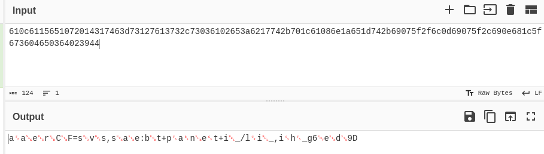

# Compact XORs

## Prompt

I found some hex in a file called fleg, but I'm not sure how it's encoded. I'm pretty sure it's some kind of xor...

## Solution


Throwing the string contained in `fleg` into CyberChef `From Hex` shows a pattern of present and missing characters for a flag.

Playing with the input reveals that XORing the missing character with the present character before it creates a valid flag.

```go
package main

import (
	"encoding/hex"
	"fmt"
)

func main() {
	src, _ := hex.DecodeString("610c6115651072014317463d73127613732c73036102653a6217742b701c61086e1a651d742b69075f2f6c0d69075f2c690e681c5f673604650364023944")

	for i := 0; i < len(src); i += 2 {
		src[i+1] = src[i] ^ src[i+1]
	}

	fmt.Println(string(src))
}
```

## Flag

`amateursCTF{saves_space_but_plaintext_in_plain_sight_862efdf9}`