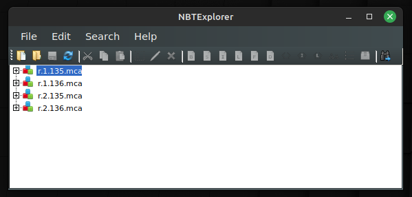
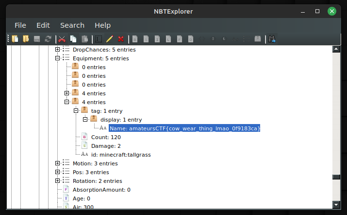

# Minceraft

## Prompt

I found these suspicious files on my minecraft server and I think there's a flag in them. I'm not sure where though.

Note: you do not need minecraft to solve this challenge. Maybe reference the minecraft region file format wiki?

## Solution

Files ending with `.mca` are Minecraft's Anvil region files. They can be opened and explored with a program like `NBTExplorer`.

From here, the flag can be searched for, revealing it in the first region file.

## Flag

`amateursCTF{cow_wear_thing_lmao_0f9183ca}`