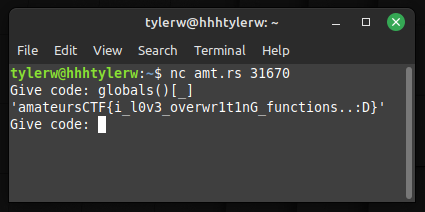

# Censorship

## Prompt

I'll let you run anything on my python program as long as you don't try to print the flag or violate any of my other rules! Pesky CTFers...

`nc amt.rs 31670`

## Solution

Using the python `globals()` command will return a dict of all globals. The flag is contained under the `_` key. There are many other ways to solve this problem.

## Flag

`amateursCTF{i_l0v3_overwr1t1nG_functions..:D}`