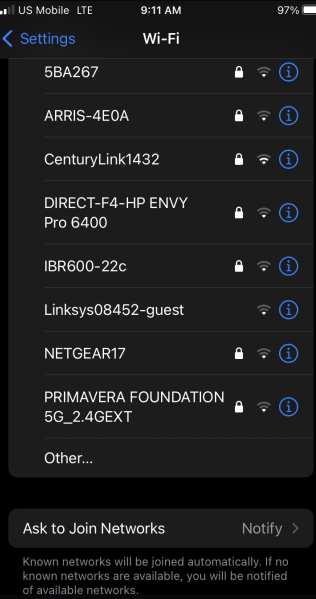
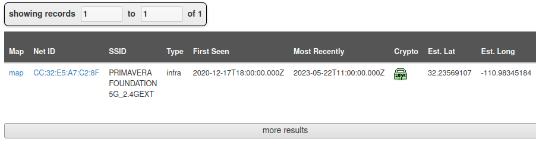
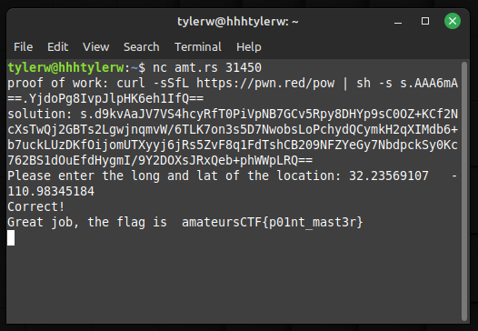

# ScreenshotGuesser

## Prompt
I screenshoted a list of wifi networks on vacation but forgot where I was at.

To check your coordinates use the provided server (pass in format `x, y`, example: 123.456789, -123.456789).

"try to look at the direction ish in which stuff becomes more clustered" - author, note: we relaxed the coordinate percision as an update.

You should be able to solve this in a manageable amount of guesses.

`nc amt.rs 31450`

## Solution

The file `screenshot.png` contains a screenshot of nearby SSIDs. 

A tool called WiGLE can be used to find the location of any wifi network. Searching for the `PRIMAVERA FOUNDATION 5G_2.4GEXT` SSID returns one [result](https://wigle.net/search?ssid=PRIMAVERA%20FOUNDATION%205G_2.4GEXT) (requires account).

Entering the longitude and latitude into the given server returns the flag.

## Flag
`amateursCTF{p01nt_mast3r}`
