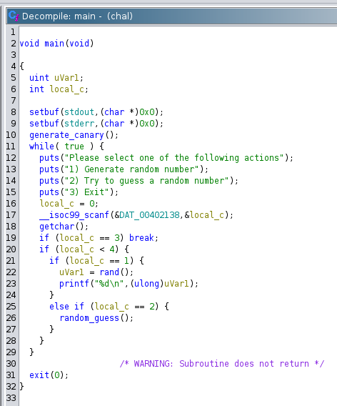
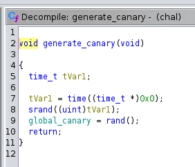
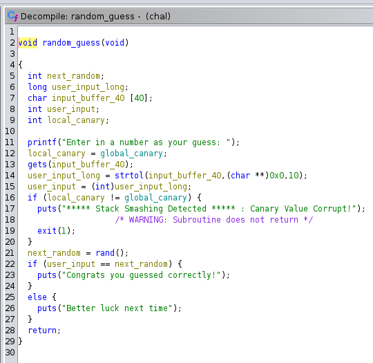
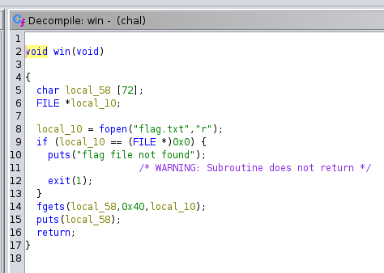

# rntk

## Prompt
check out my random number toolkit!

`nc amt.rs 31175`

## Solution
Open Ghidra and analyze the binary to find the main function.

The points of interest are `generate_canary()`, `random_guess()`, and `win()`. 

`main()` is the entry point. It runs `generate_canary()` and takes user input.

`generate_canary()` uses the current time as a seed, generates a random number, and saves it as `global_canary`.

`random_guess()` takes user input via `gets()` and is resistant to attacks by maintaining that a `local_canary` is equal to the `global canary`.

`win()` is an unreachable function that sends the flag.

Using GDB, one can analyze the call stack. Breakpoints should be set before and after the vulnerable `gets()` in order to see how it affects the stack.

## Flag
``
