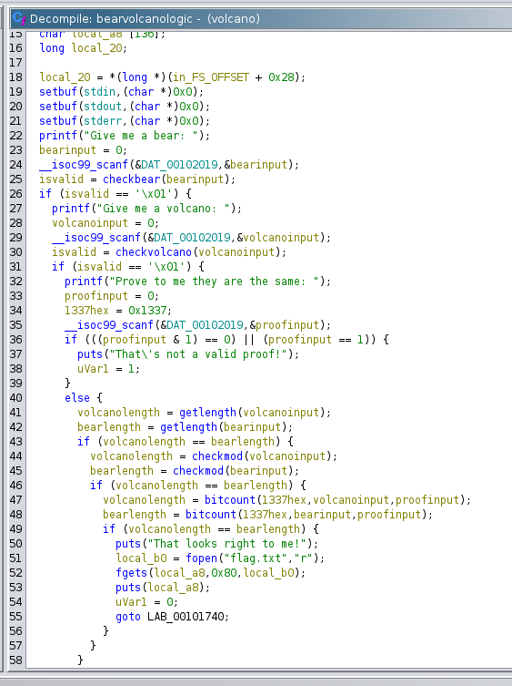
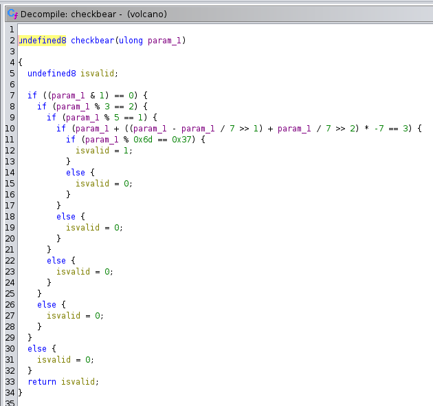
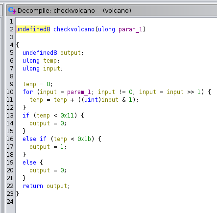
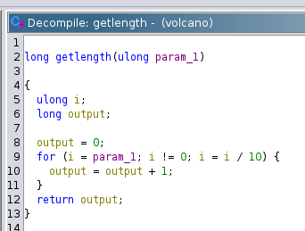
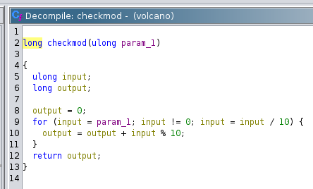
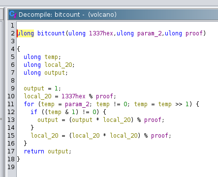
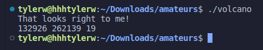
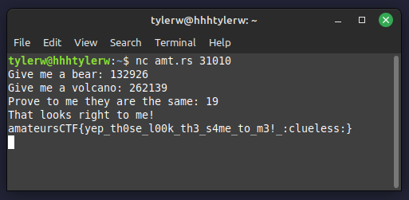

# volcano

## Prompt

Inspired by recent "traumatic" events.

`nc amt.rs 31010`

## Solution

Using Ghidra, one can see the file contains a function that takes 3 inputs, runs a bunch of tests, and determines whether or not the inputs are valid.

`bearvolcanologic()` handles input and whether or not it is valid.



`checkbear()` does "something" to validate whether or not an input is a `bear`.



`checkvolcano()` is similar and checks whether or not the second input is a `volcano`.



`getlength()` checks if `bear` and `volcano` have the same number.



`checkmod()` adds up the digits of its input.



`bitcount()` does something.



The best way to solve this is less so understanding what these weird functions do, and more so brute forcing. These functions are almost runnable C code, so they can easily be converted and ran.

```c
#include "stdint.h"
#include "stdio.h"
#include "stdlib.h"

int checkbear(uint64_t param_1) {
  int isvalid;
  
  if ((param_1 & 1) == 0) {
    if (param_1 % 3 == 2) {
      if (param_1 % 5 == 1) {
        if (param_1 + ((param_1 - param_1 / 7 >> 1) + param_1 / 7 >> 2) * -7 == 3) {
          if (param_1 % 0x6d == 0x37) {
            isvalid = 1;
          }
          else {
            isvalid = 0;
          }
        }
        else {
          isvalid = 0;
        }
      }
      else {
        isvalid = 0;
      }
    }
    else {
      isvalid = 0;
    }
  }
  else {
    isvalid = 0;
  }
  return isvalid;
}

int checkvolcano(uint64_t param_1) {
  int output;
  uint64_t temp;
  uint64_t input;
  
  temp = 0;
  for (input = param_1; input != 0; input = input >> 1) {
    temp = temp + ((uint64_t)input & 1);
  }
  if (temp < 0x11) {
    output = 0;
  }
  else if (temp < 0x1b) {
    output = 1;
  }
  else {
    output = 0;
  }
  return output;
}

uint64_t nextbear(uint64_t curr) {
    uint64_t num = curr + 1;

    while (1) {
        if (checkbear(num)) {
            break;
        }

        num += 1;
    }

    return num;
}

uint64_t nextvolcano(uint64_t curr) {
    uint64_t num = curr + 1;

    while (1) {
        if (checkvolcano(num)) {
            break;
        }

        num += 1;
    }

    return num;
}

uint64_t bitcount(uint64_t hex, uint64_t  param_2, uint64_t  proof) {
  uint64_t temp;
  uint64_t local_20;
  uint64_t output;
  
  output = 1;
  local_20 = hex % proof;
  for (temp = param_2; temp != 0; temp = temp >> 1) {
    if ((temp & 1) != 0) {
      output = (output * local_20) % proof;
    }
    local_20 = (local_20 * local_20) % proof;
  }
  return output;
}

uint64_t checkmod(uint64_t  param_1) {
  uint64_t  input;
  uint64_t  output;
  
  output = 0;
  for (input = param_1; input != 0; input = input / 10) {
    output = output + input % 10;
  }
  return output;
}

uint64_t getlength(uint64_t param_1) {
  uint64_t local_20;
  uint64_t local_10;
  
  local_10 = 0;
  for (local_20 = param_1; local_20 != 0; local_20 = local_20 / 10) {
    local_10 = local_10 + 1;
  }
  return local_10;
}


int validate(uint64_t bearinput, uint64_t volcanoinput, uint64_t proofinput) {
    uint64_t volcanolength = getlength(volcanoinput);
    uint64_t bearlength = getlength(bearinput);
    if (volcanolength == bearlength) {
        volcanolength = checkmod(volcanoinput);
        bearlength = checkmod(bearinput);
        if (volcanolength == bearlength) {
            volcanolength = bitcount(0x1337,volcanoinput,proofinput);
            bearlength = bitcount(0x1337,bearinput,proofinput);
            if (volcanolength == bearlength) {
                puts("That looks right to me!");
                printf("%ld %ld %ld\n", bearinput, volcanoinput, proofinput);
                exit(0);
            }
        }
    }
}

int main() {
    uint64_t max = 1000000;
    uint64_t bear = 0;
    uint64_t volcano = 0;
    uint64_t proof = 3;

    while (bear < max) {
        bear = nextbear(bear);
        volcano = 0;
        while (volcano < max) {
            volcano = nextvolcano(volcano);
            proof = 3;
            while (proof < 100) {
                validate(bear, volcano, proof);
                proof += 2;
            }
        }
    }

    return 0;
}
```

When ran, it outputs a valid `bear`, `volcano`, and `proof`.



Entering these into the CTF server proves they are correct.



## Flag

`amateursCTF{yep_th0se_l00k_th3_s4me_to_m3!_:clueless:}`